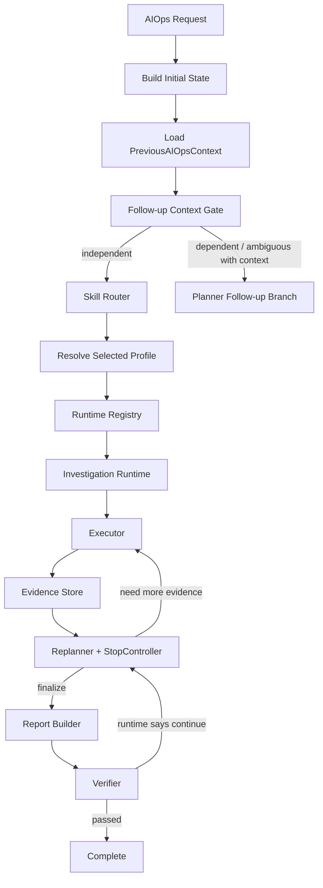

# AIOps Investigation Architecture

## 概述

AgentAssistant 的 AIOps 侧已经完成从旧式分叉诊断链路向统一 Investigation Runtime 的迁移。

当前正式目标是：
- 让实时诊断只依赖可解释、可收敛、可治理的执行路径
- 把普通 RAG 与实时 AIOps 明确分层
- 让默认巡检、专项诊断、追问补充共享同一套状态与证据语义

## 为什么要重构

旧架构存在几个长期问题：
- generic 自由长链容易出现 Planner 与 Executor 脱节
- verifier 打回后会把自由文本建议重新塞回 plan，导致 Trace 持续增长
- 旧 skill 会把专家经验直接写成执行计划，造成证据不足却过度推断
- 普通 RAG 与实时 AIOps 语义混用，容易把 mock/demo 数据误写成当前事实

因此，当前架构的原则是：
- 不再依赖自由长链作为默认诊断入口
- 一切正式专项诊断都必须落到 execution profile + runtime
- Follow-up 必须依赖上一轮上下文，而不是重新猜测用户意图

## 演进阶段

### Phase 1：架构止血
- 新增 investigation 基础模型
- Skill 拆分为：
  - `execution_profile`
  - `reference_playbook`
  - `draft`
- 未命中 execution profile 的 custom AIOps 不再进入旧 generic 长链

### Phase 2：Disk Runtime 迁移
- `disk_pressure_profile` 正式迁移到 Evidence-Driven Investigation Runtime
- 引入：
  - InvestigationTask
  - Evidence Store
  - StopController
  - Disk 专属报告与 verifier 逻辑

### Phase 3：Runtime Registry + Patrol Dispatcher
- 抽出 runtime registry
- 默认巡检从旧 patrol 深链切到 dispatcher / runtime 体系

### Phase 4：CPU / Memory Runtime
- 新增：
  - `cpu_pressure_profile`
  - `memory_pressure_profile`
- 接入 Host Agent 的 CPU / Memory 真实接口

### Phase 4.5：真实主机语义校正
- 修复 `cpu_summary` / `memory_summary` 与真实 Host Agent 字段兼容
- 把默认巡检告警源升级为：
  - `mock`
  - `remote_host`
  - `disabled`

### Phase 4.8：Host Health Patrol
- 默认巡检升级为 `host_health_patrol_profile`
- 至少采集：
  - CPU
  - 内存
  - 磁盘
  - 活跃告警

### Phase 4.9：Agentic Escalation + Follow-up
- 默认巡检发现异常后可自动升级到专项 Profile
- Follow-up Context Gate 接通
- 解释型追问与失败反馈型追问分流
- Tavily / `web_search` 仅在必要时受控触发

### Phase 5：Legacy Cleanup
- 清理旧 generic 深链
- 下线旧 disk cleanup 主入口
- 下线旧 patrol 深链
- 固化正式文档与验收矩阵

## 当前正式架构

## 普通 RAG 与 AIOps 的边界

### 普通 RAG
- 只做知识问答
- 不读取实时服务器状态
- 若用户询问“当前 CPU/内存/磁盘/系统情况”，会受控提示切换 AIOps
- 若引用知识库案例，必须标注为历史示例或参考

### AIOps
- 只在 AIOps 模式下做实时诊断
- 优先采集本地实时证据
- 再补本地上下文证据
- 再补本地 Runbook / 外部参考

## 默认巡检

默认巡检当前的正式入口是：
- `host_health_patrol_profile`

它的职责是：
1. 采集 CPU / 内存 / 磁盘基础健康摘要
2. 读取活跃告警
3. 识别异常
4. 自动升级进入 CPU / Memory / Disk 对应专项 Profile

它不再只是“查告警然后结束”。

## 专项 Profile

当前正式可执行的 execution profile：
- `cpu_pressure_profile`
- `memory_pressure_profile`
- `disk_pressure_profile`
- `host_health_patrol_profile`

每个 profile 都通过 runtime registry 暴露统一接口：
- `build_initial_tasks`
- `update_evidence_store`
- `build_follow_up_tasks`
- `decide_stop`
- `build_report`
- `verify_report`

## 证据优先级

### 第一层：本地实时证据
- CPU：
  - `get_cpu_summary`
  - `list_top_cpu_processes`
- Memory：
  - `get_memory_summary`
  - `list_top_memory_processes`
- Disk：
  - `get_disk_usage`
  - `list_large_directories`
  - `list_large_files`
  - `query_docker_disk_usage`
  - `query_deleted_open_files`

### 第二层：本地上下文证据
只有在存在 `service_name` / `alert_name` / 目标对象时，才会补查：
- `search_historical_tickets`
- `search_log`
- `get_service_info`

### 第三层：本地 Runbook / RAG
- CPU 使用率过高排查 runbook
- 内存使用率过高排查 runbook
- 磁盘使用率过高清理 runbook

### 第四层：外部补充参考
只有在必要时才触发 `web_search`

## Follow-up Context Gate

Follow-up Gate 会把当前问题分为：
- `independent`
- `dependent_followup`
- `ambiguous`

### independent
示例：
- CPU 状况怎么样？
- 请检查内存情况
- 请开始一次巡检

这类问题会作为新的实时诊断入口。

### dependent_followup
示例：
- 为什么你建议先观察热点进程？
- 为什么建议先看 Docker build cache？
- 按你说的做了还是没效果
- 继续查别的方法

这类问题会恢复 `previous_aiops_context`，优先走 follow-up 处理。

### ambiguous
示例：
- 再看看
- 继续
- 这个呢

若存在上一轮上下文，会尽量按 follow-up 处理；否则受控返回澄清提示。

## Tavily / web_search 触发规则

`web_search` 不是默认每轮都触发。

当前只在两种场景允许：

### 1. 本地知识不足
- `retrieve_knowledge` 无有效结果
- Runbook 不足以支撑新的处理建议
- Follow-up resolver 判断需要 external reference

### 2. 用户反馈上一轮建议无效
例如：
- 按你说的做了还是没效果
- 重新执行后还是不行
- 这个办法没用
- 继续查别的思路

此时系统会先恢复上一轮摘要，再由 follow-up resolver 判断是否需要触发 `web_search`。

外部结果必须：
- 标记为“外部补充参考”
- 不混写成本地实时证据
- 不改写为已确认现场事实

## Action Safety

当前系统不会自动执行高风险动作。

报告只会输出动作分级：
- 低风险建议
- 需人工确认或审批的动作
- 禁止自动执行或高风险动作

并明确说明：
- 本轮未执行任何重启、扩容、限流、清理或其他高风险操作
- 若后续接入危险工具，必须经过审批节点

## Legacy 保留策略

Phase 5 之后，正式主路径已经不再依赖：
- generic planner fallback
- 旧 free-form generic diagnosis 长链
- 旧 disk cleanup 主入口
- 旧 patrol 深诊断链

目前仍保留的兼容性内容只有两类：
1. 受控停止结果，例如 `controlled_no_profile`
2. 少量内部辅助模块，例如 `patrol_dispatch.py` 的 alert->profile 映射

这些保留项不会重新变成正式执行主入口。

## 后续建议

如果后续继续提升产品质感，优先建议：
1. 提升前端 Trace 与报告排版的一致性
2. 为 follow-up enrichment 增加更精炼的摘要模板
3. 固化更多 remote_host 端到端测试夹具
4. 若审批链要上线，再把危险动作接入正式 Human-in-the-loop 节点
## Phase 6：Heartbeat Patrol 与 Remediation Candidates

### Heartbeat Patrol
- 新增独立的 heartbeat 管理模块，用于定时执行轻量主机健康扫描。
- 轻量扫描只采集：
  - `get_cpu_summary`
  - `get_memory_summary`
  - `get_disk_usage`
  - `get_patrol_alerts`
- 若 CPU / 内存 / 磁盘均 healthy 且无 active alerts：
  - 只保存 heartbeat summary
  - 不调用 LLM
  - 不触发 Tavily
  - 不生成执行动作
- 若存在 warning / critical 或 active alert：
  - 自动复用现有 `host_health_patrol_profile`
  - 再按既有升级逻辑进入 CPU / Memory / Disk 专项诊断
  - 产出 diagnosis report summary 与 remediation candidates
  - 仍不自动 execute

### Remediation Candidates
- CPU / Memory / Disk 诊断会在最终报告中追加 `Remediation Candidates`
- 候选动作分为四类：
  1. 可直接给出的低风险建议
  2. 可 dry-run 的动作
  3. 需人工确认或审批的动作
  4. 禁止自动执行的动作
- 第一版仅调用 Host Agent 的 remediation dry-run，不自动执行 execute

### Dry-run / Execute 边界
- `dry_run_remediation_action` 调用 Linux Host Agent 的 `/api/v1/remediation/dry-run`
- `execute_remediation_action` 调用 `/api/v1/remediation/execute`
- execute 必须带 `approval_token`
- forbidden action 永远在主项目先拒绝
- 所有 dry-run / execute 结果都会写入主项目 audit log
